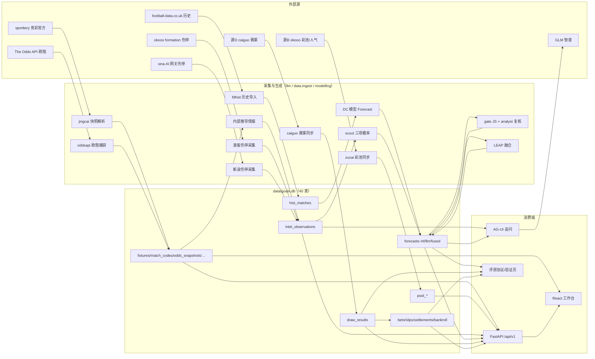

# 数据源与数据流

> 从"外部世界"到"页面上的数字"的完整路径：源 → 采集器 → 表 → 调度 → 消费端。
> 表结构与领域模型见 [db-and-domains.md](./db-and-domains.md)；术语见根 [CONTEXT.md](../CONTEXT.md)。
> 调度时刻表 = `schedules.py` 八 deployment（Asia/Shanghai，协议 run-protocol-v1.md §3，启动后不改口径）。

## 总图

## 逐源明细

| # | 源 | 接口/页面 | 采集器 | 落表 | 幂等方式 | 失败语义 |
| --- | --- | --- | --- | --- | --- | --- |
| 1 | sporttery 官方 | 竞彩在售 JSON（五玩法） | `data/ingest/sporttery.py` | fixtures/match_codes/odds_snapshots(purpose=live)/sale_statuses + quote_observations | 观测 raw_sha256 + 业务唯一键 | 解析失败抛错（daily-capture 红） |
| 2 | The Odds API | /v4 sports odds（pinnacle 等 book 三向） | `data/ingest/oddsapi.py` | odds_snapshots(source=odds_api:*) + quote_observations | 同上；**credit 预算 480/月，超限抛错**（月 40/日 2 credits 用量内） | 429/credit 耗尽抛错不重试 |
| 3 | football-data.co.uk | CSV（五大+N1，5 季） | `data/ingest/fdhist.py` | hist_matches | 导入幂等（重复行吸收） | 单文件失败跳过并计数 |
| 4 | 源B（okooo） | 传统足彩期次页（服务端渲染） | `data/ingest/zucai.py` | pool_periods/pool_matches/public_shares/pool_sync_runs | 期次+对阵唯一键；份额 append | 源不可达 502（API 触发路径），调度路径告警 |
| 5 | 源D（caiguo） | 赛果页 | `data/ingest/caiguo.py` | draw_results(+revisions)/draw_sync_runs | 业务键 upsert；更正走 revision 留痕 | not_finished/stored_differs 进 pending_manual 人工清单 |
| 6 | 内部推导 | hist_matches（近况/H2H） | `llm/collect.py` | intel_observations | (fixture,collector,raw_hash) 唯一 | 无映射零行（诚实计数） |
| 7 | okooo formation | /soccer/match/{id}/formation/ HTML | `llm/okooo_formation.py` | intel_observations | 同上（collector=okooo-formation） | 单页 405/失败跳过计数，不阻塞 |
| 8 | sina AI 网关 | mix.lottery 纯 JSON（jczqOnSellMatches + footballMatchTeamInjury） | `llm/sina_intel.py` | intel_observations | 同上（collector=sina-injury）；matchNo→fixture 一跳映射 | 单源整体故障不阻塞其余源 |
| 9 | GLM（智谱） | OpenAI 兼容 v4（Coding Plan 端面，403/429 降按量） | `llm/client.py` + scout/gate/fusion/ask | forecasts(track=llm/fused) + cost_ledger | (fixture,track,content_hash) 幂等 | 熔断三级 60/80/95%（80% 仅彩池用途）；ask 逐字流式 SSE |
| 10 | 人工 | 投注页录入（开奖/真金出入金/复核结论/盲评） | API 端点 | draw_results(+revisions)/bankroll_events/review_items/blind_reviews | 业务唯一键；更正必留痕 | 服务器校验唯一权威 |

## 调度时刻表（Prefect 八 deployment，Asia/Shanghai）

| 时刻 | deployment/flow | 做什么 | 上游依赖 |
| --- | --- | ---| --- |
| 10:00 / 19:00 | daily-capture | 竞彩快照 → 场次/报价/销售状态 → DC Forecast(track=ml) | 源1/源2 |
| 每 30 分钟 | eu-odds-closing | 开球前 35 分钟窗口内拉收盘价（窗口外零成本跳过） | 源2 |
| 10:20 / 16:20 / 22:20 | pool-snapshot | 彩池期次/对阵/人气三拍 | 源4 |
| 10:40 / 22:40 | intel-collect | 内部推导 + 澳客伤停 + 新浪伤停（三源，单源故障不阻塞） | 源6/7/8 |
| 10:50 / 22:50 | scout-line | scout 三项 → gate JS 散度路由 → analyst 复核 → LEAP 融合 | intel-collect 产出 |
| 18:00-05:59 每 30 分钟 + 08:00 补扫 | draw-results-sync（双 deployment） | 赛果同步 → 导入 draw_results | 源5 |
| 23:30 | daily-wrap | 结算批跑 → CLV 对账 → 账务核查 → M3 评测报告 | 当日全部 |

拉起方式：`task serve-schedules`（专用 Prefect server + serve 两进程；本机睡眠漏跑如实计入分母）。**合入 main 后必须重启 serve。**

## 消费端

- **API/UI**（contracts/openapi/v1.json 契约先行）：场次页/研究页（报价证据+三轨证据链）、彩池页（份额/EV+证据卡）、投注/历史/验证/资金页、复核页（队列+盲评）。
- **AG-UI 追问**（`POST /fixtures/{id}/ask`）：prompt 只注入该场 intel_observations，流式 SSE 回答；无情报不调模型（零成本）；usage 记 cost_ledger(ask)。
- **评测协议**（`/validation/m3-protocol`）：三轨前瞻评分 + 配对 RPS/DM + Tier A/B 冻结阈值状态行——LLM/Fused 永远参考列，真钱资格只读 ML 轨（票 04 冻结）。

## 不变量（跨表）

- append-only 触发器：`odds_snapshots`、`intel_observations` 禁 UPDATE/DELETE（分母铁证与证据层）。
- 开奖/结算更正必须走 revision 留痕（draw_result_revisions / settlement_revisions）。
- forecasts 任何轨不可覆写——更新=追加新行，读取按 (issued_at,id) 最新。
- Bankroll 只受真金记录影响（paper 注单不进资金池）。
- 表 SQL 只出现在归属包（ADR-0008，test_sql_ownership 执法）。
