# 数据库与领域模型

> 面向"下一个不了解库的会话"：一页建立表结构、领域归属与生命周期的完整心智模型。
> 术语定义以根目录 [CONTEXT.md](../CONTEXT.md) 为单一事实源，本文不重复定义。
>
> - **生成块**：`<!-- schema-doc:BEGIN/END -->` 标记内（全列表格/ER 图）由 `task schema-doc-export` 从真库生成，**勿手改**（`test_schema_doc.py` 断言漂移）。迁移加列/加表后：重跑导出 + 在速览表补一行。
> - **写权限**：表 SQL 只允许出现在归属包（ADR-0008，`table_owners.py` 登记，执法测试 `test_sql_ownership.py`）。

## 目录

| 节 | 内容 |
| --- | --- |
| [1. 表速览](#t1) | 44 张表 × 域 × 用途 × 关键口径 × 生命周期，一张总表 |
| [2. 硬不变量](#t2) | append-only 触发器 / 防前视红线 / 事实源层级等全局铁律 |
| [3. 表间关系（ER）](#t3) | 主键与外键边总览（Mermaid） |
| [4. 全列明细](#t4) | 按域分组的生成块（44 表） |

## 1. 表速览

生命周期口径：**append** = 只增不改；**幂等** = 唯一键吸收重复；**upsert** = 最新值覆盖；**种子** = migrations 播种。

### data 域（fixtures / results / pool / ingest）

| 表 | 用途 | 关键口径 | 生命周期 |
| --- | --- | --- | --- |
| `teams` / `competitions` | 队伍与赛事典 | canonical_name 唯一；tier=tier1/tier2 投入分层；odds_api_sport_key=欧赔 join 键 | append |
| `fixtures` | 场次主表（UTC） | odds_api_event_id/join_method/joined_at 记欧赔映射（auto/manual）；stage 杯赛阶段预留 | append（映射列 upsert） |
| `match_codes` | 官方销售编号 | 竞彩"周六001"/池期次场号；business_date=北京业务日；source_match_id=源站场次 id（一跳确定性键） | append+幂等 (kind,business_date,code) |
| `odds_snapshots` | 报价快照 | source（sporttery / odds_api:<book>）、purpose（live_capture/closing）、observation_id→存证 | append+幂等，触发器禁改删 |
| `quote_observations` | 原始报价观测存证（票 35） | endpoint+parse_version+raw_sha256；两次捕获可共用一次观测 | append-only |
| `sale_statuses` | 销售状态/单固资格时序 | 竞彩快照解析；observation_id 关联 | append |
| `draw_results` | 开奖**唯一事实源** | upsert 可更正（必须走 revision 留痕）；void 标记在此 | upsert+revision |
| `draw_result_revisions` | 开奖更正留痕 | previous/replacement/reason 全存 JSON | append |
| `draw_sync_runs` | 官方赛果同步日志 | uniform 源（票 44 切换；此前源D）；pending_manual 待人工清单 | append |
| `uniform_result_observations` | 官方赛果**观测**（票 44） | UNIQUE(match_id,observed_at)；poolStatus 迁移多跑留痕；join 键=match_codes.source_match_id；终态观测落 draw_results | append-only |
| `draw_reconciliation_runs` | 对账运行日志（票 44） | 参照源（源D/openfootball）vs 事实：一致/比分不一致/void 冲突/缺果 + 待人工清单 | append |
| `source_coverage` | 覆盖现态维表（票 44，定则 4） | 空≠无：absent 断言仅当 covered；coverage_date 语义随源（uniform=matchDate、源D=业务日、openfootball=赛季键、understat=起始年） | upsert |
| `understat_matches` | xG 特征现态（票 45） | 逐场 xG/xGA+npxG/npxGA；prior_*=本季开球日严格早于本场的累计（防前视红线，同日互不可见）；forecast{w,d,l} 仅已赛场次；fixture_id=±1 日+双队名唯一命中 | upsert by match_id |
| `understat_sync_runs` | xG 同步日志 | 逐联赛×赛季计数；results_missing_npxg 金丝雀 | append |
| `elo_ratings` | clubelo Elo 评级层（票 74） | 区间粒度：一行=一队一段同 Elo 的 [valid_from,valid_to]（点时查询与逐日快照等价）；日拍单请求全量快照+--backfill 逐队全历史；club=源侧英文名，中文映射走 team_aliases（消费侧） | upsert (club,valid_from) |
| `srcb_change_rows` / `srcb_change_runs` | 源B欧指变化时序语料（票 49 采集先行） | 行=mid×pid×三向十进制+距开赛分钟（UNIQUE 幂等，行不可变）；无 fixture_id（mid↔身份绑定属消费侧，数值交叉验证后落）；17 核心 pid 每日两拍回溯式 | append-only |
| `pool_periods` / `pool_matches` | 彩池期次与对阵 | euro_odds_*=期次页三向欧指兜底；source_match_id=澳客场次 id | append+幂等 |
| `pool_states` / `public_shares` | 销量/滚存 + 公众份额 | 官方公布 upsert 最新；源B 人气 append（meta 带注数量级） | upsert / append |
| `pool_sync_runs` | 彩池同步日志 | 期次/对阵/份额计数 | append |
| `hist_matches` | fd.co.uk 历史底座 | 五大+N1+扩五联（票 46）含 PSC/AvgC 收盘价——DC 训练与回测分母 | append+幂等 |
| `cost_ledger` | 成本台账 | category+note 是口径维度（llm_call 的 note=model/surface/purpose） | append |

### modelling 域

| 表 | 用途 | 关键口径 | 生命周期 |
| --- | --- | --- | --- |
| `forecasts` | 三轨预测 | track=ml/llm/fused；ml 轨含 xG blend（票 47，model_version dc-xgblend- 前缀溯源）；**ml 轨是真钱资格唯一口径（票 04 冻结），任何轨不可覆写** | append+幂等 (fixture,content_hash) |
| `team_aliases` | 队名别名对齐 | 竞彩名↔训练域↔odds_api 名；source=odds_api/manual | append+幂等 |

### llm 域（M3）

| 表 | 用途 | 关键口径 | 生命周期 |
| --- | --- | --- | --- |
| `intel_observations` | 情报存证 | UNIQUE(fixture,collector,raw_hash) 幂等——双源同情报各自成行互校验；触发器禁改删 | append-only |
| `divergences` | ML×LLM JS 散度日志 | metric=js_had_ml_llm，重复计算自然累积 | append |
| `review_items` | 复核队列 | route=pre_match（gate JS>0.06 Tier1）/post_settle（赛后一对一错）；结论三分类只进评测集（票 05 冻结） | append+幂等，open→done |
| `blind_reviews` | 盲评双周匿名二选一 | choice=ml/llm | append+幂等 (cycle,fixture) |

### betting 域

| 表 | 用途 | 关键口径 | 生命周期 |
| --- | --- | --- | --- |
| `bets` | 注单 | mode=paper/live；market_kind=fixed/pool；snap_prob_*/snap_ev_*=锁注时点快照（票 41 防泄漏）；状态机 open→won/lost/void/partial | append |
| `bet_slips` / `bet_legs` / `combinations` / `pool_picks` | 票/腿/复式物化/池票选场 | 腿引用锁定 OddsSnapshot；combinations=任9 笛卡尔积落行 | append |
| `settlements` / `settlement_revisions` | 结算与更正留痕 | 单关返本、串关无效腿按 1 继续 | append / append |
| `bankroll_events` | 资金事件 | balance_after 链式核对；**只真金记录进 Bankroll** | append |

### evaluation 域

| 表 | 用途 | 关键口径 | 生命周期 |
| --- | --- | --- | --- |
| `backtest_runs` / `-predictions` / `-bets` / `-metrics` | 回测四件套 | run（label/params/summary）、prediction（had/fair+model_fingerprint）、bet（kelly/EV）、metric（scope 分层） | append |
| `clv_records` | CLV 对账 | taken_odds vs close_prob；close_basis 分层（pinnacle 主锚/betfair 辅/consensus 兜底） | append+幂等 |
| `haircut_calibrations` | EV 折价校准 | scope×market 分位 haircut；method_version 随行 | append |

### infra / 脚手架

| 表 | 用途 | 关键口径 | 生命周期 |
| --- | --- | --- | --- |
| `markets` / `selections` | 玩法与选项字典 | migrations 播种，业务表 FK 引用；无归属包写 | 种子 |

`ev_assessments`（票 03 预留脚手架，自建库起无写入方）已 DROP（票 48
migration v16）——陈盘信号等派生读模型不落表，append-only 原料 +
as-of 纯函数重放即决策存证；EVAssessment 口径在视图与 betting 包函数。

无表实体（口径约定，不落库）：MarketGroup、MatchIntel（票 09 废弃，由 IntelObservation 承接）、EvidenceSummary（视图态）、DecisionKey（betting 包函数口径）、ClosingLine（odds_snapshots.purpose='closing' 切片）、StaleLineSignal（票 48 as-of 纯派生，不落表）。

## 2. 硬不变量

| # | 不变量 | 落点 |
| --- | --- | --- |
| 1 | append-only 铁证（触发器禁 UPDATE/DELETE） | odds_snapshots、forecasts、quote_observations、sale_statuses、intel_observations、draw_result_revisions、settlement_revisions、draw_sync_runs、pool_sync_runs、uniform_result_observations、draw_reconciliation_runs、understat_sync_runs |
| 2 | 三时间口径（event/published/observed，不伪造） | odds_snapshots.observed_at/source_updated_at；understat_matches 无 published 列（源不提供） |
| 3 | 防前视红线 | understat_matches.prior_* 只累计开球日严格早于本场的完场；Forecast as-of 读取（票 41） |
| 4 | 事实源层级 | draw_results 唯一事实源（官方 uniform 终态导入）；源D/openfootball 仅审计对账，不落事实 |
| 5 | 空≠无（定则 4） | source_coverage 四态 covered/fetched_empty/fetch_failed/not_covered |
| 6 | 预测资格冻结 | ml 轨=真钱唯一口径（票 04）；前瞻评分=赛前最新 Forecast（票 34），模型迭代经 model_version 溯源 |

## 3. 表间关系（ER）

只画主键与外键边；全列细节见[第 4 节](#t4)。可空 FK 用 `}o`（零或多），非空 `}|`（一或多）。

```mermaid
erDiagram
    backtest_bets {
        INTEGER id PK
    }
    backtest_metrics {
        INTEGER id PK
    }
    backtest_predictions {
        INTEGER id PK
    }
    backtest_runs {
        INTEGER id PK
    }
    bankroll_events {
        INTEGER id PK
    }
    bet_legs {
        INTEGER id PK
    }
    bet_slips {
        INTEGER id PK
    }
    bets {
        INTEGER id PK
    }
    blind_reviews {
        INTEGER id PK
    }
    clv_records {
        INTEGER id PK
    }
    combinations {
        INTEGER id PK
    }
    competitions {
        INTEGER id PK
    }
    cost_ledger {
        INTEGER id PK
    }
    divergences {
        INTEGER id PK
    }
    draw_reconciliation_runs {
        INTEGER id PK
    }
    draw_result_revisions {
        INTEGER id PK
    }
    draw_results {
        INTEGER id PK
    }
    draw_sync_runs {
        INTEGER id PK
    }
    elo_ratings {
    }
    fixtures {
        INTEGER id PK
    }
    forecasts {
        INTEGER id PK
    }
    haircut_calibrations {
        INTEGER id PK
    }
    hist_matches {
        INTEGER id PK
    }
    intel_observations {
        INTEGER id PK
    }
    markets {
        TEXT code PK
    }
    match_codes {
        INTEGER id PK
    }
    odds_snapshots {
        INTEGER id PK
    }
    pool_matches {
        INTEGER id PK
    }
    pool_periods {
        INTEGER id PK
    }
    pool_picks {
        INTEGER id PK
    }
    pool_states {
        INTEGER pool_period_id PK
    }
    pool_sync_runs {
        INTEGER id PK
    }
    public_shares {
        INTEGER id PK
    }
    quote_observations {
        INTEGER id PK
    }
    review_items {
        INTEGER id PK
    }
    sale_statuses {
        INTEGER id PK
    }
    selections {
        INTEGER id PK
    }
    settlement_revisions {
        INTEGER id PK
    }
    settlements {
        INTEGER id PK
    }
    source_coverage {
        INTEGER id PK
    }
    srcb_change_rows {
        INTEGER id PK
    }
    srcb_change_runs {
        INTEGER id PK
    }
    team_aliases {
        INTEGER id PK
    }
    teams {
        INTEGER id PK
    }
    understat_matches {
        INTEGER id PK
    }
    understat_sync_runs {
        INTEGER id PK
    }
    uniform_result_observations {
        INTEGER id PK
    }
    backtest_bets }|--|| backtest_runs : run_id
    backtest_metrics }|--|| backtest_runs : run_id
    backtest_predictions }|--|| hist_matches : hist_match_id
    backtest_predictions }|--|| backtest_runs : run_id
    bankroll_events }o--|| bet_slips : slip_id
    bankroll_events }o--|| bets : bet_id
    bet_legs }|--|| selections : market_code
    bet_legs }|--|| selections : selection_code
    bet_legs }o--|| odds_snapshots : snapshot_id
    bet_legs }|--|| fixtures : fixture_id
    bet_legs }|--|| bets : bet_id
    bet_slips }o--|| pool_periods : pool_period_id
    bets }o--|| bet_slips : slip_id
    blind_reviews }|--|| fixtures : fixture_id
    clv_records }|--|| fixtures : fixture_id
    clv_records }|--|| bets : bet_id
    combinations }|--|| bet_slips : slip_id
    divergences }|--|| fixtures : fixture_id
    draw_result_revisions }|--|| fixtures : fixture_id
    draw_results }|--|| fixtures : fixture_id
    fixtures }|--|| teams : away_team_id
    fixtures }|--|| teams : home_team_id
    fixtures }|--|| competitions : competition_id
    forecasts }|--|| fixtures : fixture_id
    intel_observations }|--|| fixtures : fixture_id
    match_codes }|--|| fixtures : fixture_id
    odds_snapshots }|--|| selections : market_code
    odds_snapshots }|--|| selections : selection_code
    odds_snapshots }o--|| quote_observations : observation_id
    odds_snapshots }|--|| fixtures : fixture_id
    pool_matches }|--|| pool_periods : pool_period_id
    pool_periods }|--|| markets : market_code
    pool_picks }o--|| fixtures : fixture_id
    pool_picks }|--|| bet_slips : slip_id
    pool_states }o--|| pool_periods : pool_period_id
    public_shares }|--|| pool_periods : pool_period_id
    review_items }|--|| fixtures : fixture_id
    sale_statuses }o--|| quote_observations : observation_id
    sale_statuses }|--|| fixtures : fixture_id
    selections }|--|| markets : market_code
    settlement_revisions }|--|| settlements : settlement_id
    settlements }o--|| bet_slips : slip_id
    settlements }o--|| bets : bet_id
    team_aliases }|--|| teams : team_id
    understat_matches }o--|| fixtures : fixture_id
    uniform_result_observations }o--|| fixtures : fixture_id
```

<!-- schema-doc:BEGIN:er -->

<!-- schema-doc:END:er -->

## 4. 全列明细（按域分组，生成块）

*以下各表全列由导出器生成（marker 块内勿手改）。*

### data 域

<!-- schema-doc:BEGIN:table:teams -->
#### `teams`

| 列 | 类型 | 约束 |
| --- | --- | --- |
| `id` | INTEGER | PK |
| `canonical_name` | TEXT | NOT NULL |
| `created_at` | TEXT | NOT NULL |

唯一键 `UNIQUE(`canonical_name`)`
<!-- schema-doc:END:table:teams -->
<!-- schema-doc:BEGIN:table:competitions -->
#### `competitions`

| 列 | 类型 | 约束 |
| --- | --- | --- |
| `id` | INTEGER | PK |
| `name` | TEXT | NOT NULL |
| `tier` | TEXT | NOT NULL，DEFAULT 'tier2' |
| `odds_api_sport_key` | TEXT | — |
| `api_football_league_id` | INTEGER | — |
| `created_at` | TEXT | NOT NULL |

唯一键 `UNIQUE(`name`)`
<!-- schema-doc:END:table:competitions -->
<!-- schema-doc:BEGIN:table:fixtures -->
#### `fixtures`

| 列 | 类型 | 约束 |
| --- | --- | --- |
| `id` | INTEGER | PK |
| `competition_id` | INTEGER | NOT NULL，FK→competitions.id |
| `kickoff_utc` | TEXT | NOT NULL |
| `home_team_id` | INTEGER | NOT NULL，FK→teams.id |
| `away_team_id` | INTEGER | NOT NULL，FK→teams.id |
| `stage` | TEXT | — |
| `odds_api_event_id` | TEXT | — |
| `odds_api_sport_key` | TEXT | — |
| `join_method` | TEXT | — |
| `joined_at` | TEXT | — |
| `propline_event_id` | TEXT | — |
| `propline_sport_key` | TEXT | — |

唯一键 `UNIQUE(`competition_id`, `kickoff_utc`, `home_team_id`, `away_team_id`)`
<!-- schema-doc:END:table:fixtures -->
<!-- schema-doc:BEGIN:table:match_codes -->
#### `match_codes`

| 列 | 类型 | 约束 |
| --- | --- | --- |
| `id` | INTEGER | PK |
| `fixture_id` | INTEGER | NOT NULL，FK→fixtures.id |
| `kind` | TEXT | NOT NULL |
| `business_date` | TEXT | NOT NULL |
| `code` | TEXT | NOT NULL |
| `source_match_id` | TEXT | — |
| `is_single` | INTEGER | — |

唯一键 `UNIQUE(`kind`, `business_date`, `code`)`
<!-- schema-doc:END:table:match_codes -->
<!-- schema-doc:BEGIN:table:odds_snapshots -->
#### `odds_snapshots`

| 列 | 类型 | 约束 |
| --- | --- | --- |
| `id` | INTEGER | PK |
| `fixture_id` | INTEGER | NOT NULL，FK→fixtures.id |
| `market_code` | TEXT | NOT NULL，FK→selections.market_code |
| `selection_code` | TEXT | NOT NULL，FK→selections.code |
| `source` | TEXT | NOT NULL |
| `purpose` | TEXT | NOT NULL，DEFAULT 'live_capture' |
| `odds` | REAL | NOT NULL |
| `captured_at` | TEXT | NOT NULL |
| `meta` | TEXT | — |
| `created_at` | TEXT | NOT NULL |
| `observed_at` | TEXT | — |
| `source_updated_at` | TEXT | — |
| `observation_id` | INTEGER | FK→quote_observations.id |

唯一键 `UNIQUE(`fixture_id`, `market_code`, `selection_code`, `source`, `captured_at`, `odds`)`

append-only 触发器：`odds_snapshots_no_delete`、`odds_snapshots_no_update`
<!-- schema-doc:END:table:odds_snapshots -->
<!-- schema-doc:BEGIN:table:quote_observations -->
#### `quote_observations`

| 列 | 类型 | 约束 |
| --- | --- | --- |
| `id` | INTEGER | PK |
| `source` | TEXT | NOT NULL |
| `purpose` | TEXT | NOT NULL，DEFAULT 'live' |
| `observed_at` | TEXT | NOT NULL |
| `source_updated_at` | TEXT | — |
| `snapshot_at` | TEXT | — |
| `endpoint` | TEXT | — |
| `parse_version` | TEXT | NOT NULL |
| `raw_sha256` | TEXT | NOT NULL |
| `raw_ref` | TEXT | — |
| `summary` | TEXT | — |
| `created_at` | TEXT | NOT NULL |

append-only 触发器：`quote_observations_no_delete`、`quote_observations_no_update`
<!-- schema-doc:END:table:quote_observations -->
<!-- schema-doc:BEGIN:table:sale_statuses -->
#### `sale_statuses`

| 列 | 类型 | 约束 |
| --- | --- | --- |
| `id` | INTEGER | PK |
| `fixture_id` | INTEGER | NOT NULL，FK→fixtures.id |
| `market_code` | TEXT | — |
| `sale_state` | TEXT | NOT NULL |
| `single_eligible` | INTEGER | — |
| `observed_at` | TEXT | NOT NULL |
| `source_updated_at` | TEXT | — |
| `observation_id` | INTEGER | FK→quote_observations.id |
| `created_at` | TEXT | NOT NULL |

append-only 触发器：`sale_statuses_no_delete`、`sale_statuses_no_update`
<!-- schema-doc:END:table:sale_statuses -->
<!-- schema-doc:BEGIN:table:draw_results -->
#### `draw_results`

| 列 | 类型 | 约束 |
| --- | --- | --- |
| `id` | INTEGER | PK |
| `fixture_id` | INTEGER | NOT NULL，FK→fixtures.id |
| `home_goals` | INTEGER | NOT NULL |
| `away_goals` | INTEGER | NOT NULL |
| `half_home_goals` | INTEGER | — |
| `half_away_goals` | INTEGER | — |
| `void` | INTEGER | NOT NULL，DEFAULT 0 |
| `void_reason` | TEXT | — |
| `source` | TEXT | NOT NULL |
| `published_at` | TEXT | — |
| `created_at` | TEXT | NOT NULL |

唯一键 `UNIQUE(`fixture_id`)`
<!-- schema-doc:END:table:draw_results -->
<!-- schema-doc:BEGIN:table:draw_result_revisions -->
#### `draw_result_revisions`

| 列 | 类型 | 约束 |
| --- | --- | --- |
| `id` | INTEGER | PK |
| `fixture_id` | INTEGER | NOT NULL，FK→fixtures.id |
| `previous` | TEXT | NOT NULL |
| `replacement` | TEXT | NOT NULL |
| `reason` | TEXT | NOT NULL |
| `recorded_at` | TEXT | NOT NULL |

append-only 触发器：`draw_result_revisions_no_delete`、`draw_result_revisions_no_update`
<!-- schema-doc:END:table:draw_result_revisions -->
<!-- schema-doc:BEGIN:table:draw_sync_runs -->
#### `draw_sync_runs`

| 列 | 类型 | 约束 |
| --- | --- | --- |
| `id` | INTEGER | PK |
| `source` | TEXT | NOT NULL |
| `observed_at` | TEXT | NOT NULL |
| `business_dates` | TEXT | NOT NULL |
| `pages` | INTEGER | NOT NULL |
| `fetched` | INTEGER | NOT NULL |
| `imported` | INTEGER | NOT NULL |
| `unchanged` | INTEGER | NOT NULL |
| `unmatched` | INTEGER | NOT NULL |
| `pending_manual` | TEXT | NOT NULL |
| `parse_version` | TEXT | NOT NULL |
| `created_at` | TEXT | NOT NULL |

append-only 触发器：`draw_sync_runs_no_delete`、`draw_sync_runs_no_update`
<!-- schema-doc:END:table:draw_sync_runs -->
<!-- schema-doc:BEGIN:table:uniform_result_observations -->
#### `uniform_result_observations`

| 列 | 类型 | 约束 |
| --- | --- | --- |
| `id` | INTEGER | PK |
| `match_id` | INTEGER | NOT NULL |
| `match_num_str` | TEXT | NOT NULL |
| `match_date` | TEXT | NOT NULL |
| `business_date` | TEXT | — |
| `fixture_id` | INTEGER | FK→fixtures.id |
| `league_id` | INTEGER | — |
| `league_name` | TEXT | — |
| `result_status` | TEXT | NOT NULL |
| `pool_status` | TEXT | — |
| `full_score_raw` | TEXT | — |
| `half_score_raw` | TEXT | — |
| `home_goals` | INTEGER | — |
| `away_goals` | INTEGER | — |
| `half_home_goals` | INTEGER | — |
| `half_away_goals` | INTEGER | — |
| `win_flag` | TEXT | — |
| `odds_h` | TEXT | — |
| `odds_d` | TEXT | — |
| `odds_a` | TEXT | — |
| `goal_line` | TEXT | — |
| `betting_single` | INTEGER | — |
| `void_flag` | INTEGER | NOT NULL，DEFAULT 0 |
| `void_reason` | TEXT | — |
| `observed_at` | TEXT | NOT NULL |
| `parse_version` | TEXT | NOT NULL |
| `created_at` | TEXT | NOT NULL |

唯一键 `UNIQUE(`match_id`, `observed_at`)`

append-only 触发器：`uniform_result_observations_no_delete`、`uniform_result_observations_no_update`
<!-- schema-doc:END:table:uniform_result_observations -->
<!-- schema-doc:BEGIN:table:draw_reconciliation_runs -->
#### `draw_reconciliation_runs`

| 列 | 类型 | 约束 |
| --- | --- | --- |
| `id` | INTEGER | PK |
| `source` | TEXT | NOT NULL |
| `observed_at` | TEXT | NOT NULL |
| `business_dates` | TEXT | NOT NULL |
| `compared` | INTEGER | NOT NULL，DEFAULT 0 |
| `consistent` | INTEGER | NOT NULL，DEFAULT 0 |
| `score_mismatch` | INTEGER | NOT NULL，DEFAULT 0 |
| `void_mismatch` | INTEGER | NOT NULL，DEFAULT 0 |
| `missing_result` | INTEGER | NOT NULL，DEFAULT 0 |
| `unmatched` | INTEGER | NOT NULL，DEFAULT 0 |
| `pending_manual` | TEXT | NOT NULL |
| `parse_version` | TEXT | NOT NULL |
| `created_at` | TEXT | NOT NULL |

append-only 触发器：`draw_reconciliation_runs_no_delete`、`draw_reconciliation_runs_no_update`
<!-- schema-doc:END:table:draw_reconciliation_runs -->
<!-- schema-doc:BEGIN:table:source_coverage -->
#### `source_coverage`

| 列 | 类型 | 约束 |
| --- | --- | --- |
| `id` | INTEGER | PK |
| `source` | TEXT | NOT NULL |
| `coverage_date` | TEXT | NOT NULL |
| `league_key` | TEXT | NOT NULL，DEFAULT '' |
| `league_name` | TEXT | — |
| `match_count` | INTEGER | NOT NULL，DEFAULT 0 |
| `coverage_status` | TEXT | NOT NULL |
| `observed_at` | TEXT | NOT NULL |
| `created_at` | TEXT | NOT NULL |
| `updated_at` | TEXT | NOT NULL |

唯一键 `UNIQUE(`source`, `coverage_date`, `league_key`)`
<!-- schema-doc:END:table:source_coverage -->
<!-- schema-doc:BEGIN:table:understat_matches -->
#### `understat_matches`

| 列 | 类型 | 约束 |
| --- | --- | --- |
| `id` | INTEGER | PK |
| `match_id` | TEXT | NOT NULL |
| `league` | TEXT | NOT NULL |
| `season` | TEXT | NOT NULL |
| `datetime_utc` | TEXT | NOT NULL |
| `home_team_id` | TEXT | NOT NULL |
| `home_team` | TEXT | NOT NULL |
| `away_team_id` | TEXT | NOT NULL |
| `away_team` | TEXT | NOT NULL |
| `is_result` | INTEGER | NOT NULL，DEFAULT 0 |
| `goals_home` | INTEGER | — |
| `goals_away` | INTEGER | — |
| `xg_home` | REAL | — |
| `xg_away` | REAL | — |
| `npxg_home` | REAL | — |
| `npxg_away` | REAL | — |
| `prior_npxg_home` | REAL | — |
| `prior_npxga_home` | REAL | — |
| `prior_matches_home` | INTEGER | — |
| `prior_npxg_away` | REAL | — |
| `prior_npxga_away` | REAL | — |
| `prior_matches_away` | INTEGER | — |
| `forecast_w` | REAL | — |
| `forecast_d` | REAL | — |
| `forecast_l` | REAL | — |
| `fixture_id` | INTEGER | FK→fixtures.id |
| `first_seen_at` | TEXT | NOT NULL |
| `observed_at` | TEXT | NOT NULL |

唯一键 `UNIQUE(`match_id`)`
<!-- schema-doc:END:table:understat_matches -->
<!-- schema-doc:BEGIN:table:understat_sync_runs -->
#### `understat_sync_runs`

| 列 | 类型 | 约束 |
| --- | --- | --- |
| `id` | INTEGER | PK |
| `source` | TEXT | NOT NULL |
| `observed_at` | TEXT | NOT NULL |
| `seasons` | TEXT | NOT NULL |
| `matches` | INTEGER | NOT NULL |
| `results` | INTEGER | NOT NULL |
| `joined` | INTEGER | NOT NULL |
| `unmatched` | INTEGER | NOT NULL |
| `failed` | INTEGER | NOT NULL |
| `parse_version` | TEXT | NOT NULL |
| `created_at` | TEXT | NOT NULL |

append-only 触发器：`understat_sync_runs_no_delete`、`understat_sync_runs_no_update`
<!-- schema-doc:END:table:understat_sync_runs -->

<!-- schema-doc:BEGIN:table:elo_ratings -->
#### `elo_ratings`

| 列 | 类型 | 约束 |
| --- | --- | --- |
| `club` | TEXT | NOT NULL |
| `country` | TEXT | NOT NULL |
| `level` | INTEGER | — |
| `elo` | REAL | NOT NULL |
| `valid_from` | TEXT | NOT NULL |
| `valid_to` | TEXT | — |

唯一键 `UNIQUE(`club`, `valid_from`)`
<!-- schema-doc:END:table:elo_ratings -->

<!-- schema-doc:BEGIN:table:srcb_change_rows -->
#### `srcb_change_rows`

| 列 | 类型 | 约束 |
| --- | --- | --- |
| `id` | INTEGER | PK |
| `mid` | TEXT | NOT NULL |
| `pid` | TEXT | NOT NULL |
| `odds_h` | REAL | NOT NULL |
| `odds_d` | REAL | NOT NULL |
| `odds_a` | REAL | NOT NULL |
| `minutes_before` | INTEGER | NOT NULL |
| `time_label` | TEXT | NOT NULL |
| `observed_at` | TEXT | NOT NULL |
| `first_seen_at` | TEXT | NOT NULL |

唯一键 `UNIQUE(`mid`, `pid`, `minutes_before`, `odds_h`, `odds_d`, `odds_a`)`
<!-- schema-doc:END:table:srcb_change_rows -->

<!-- schema-doc:BEGIN:table:srcb_change_runs -->
#### `srcb_change_runs`

| 列 | 类型 | 约束 |
| --- | --- | --- |
| `id` | INTEGER | PK |
| `observed_at` | TEXT | NOT NULL |
| `mids` | TEXT | NOT NULL |
| `pids` | TEXT | NOT NULL |
| `requests` | INTEGER | NOT NULL |
| `rows_added` | INTEGER | NOT NULL |
| `rows_absorbed` | INTEGER | NOT NULL |
| `failed` | TEXT | NOT NULL |
| `parse_version` | TEXT | NOT NULL |
| `created_at` | TEXT | NOT NULL |

append-only 触发器：`srcb_change_runs_no_delete`、`srcb_change_runs_no_update`
<!-- schema-doc:END:table:srcb_change_runs -->

<!-- schema-doc:BEGIN:table:pool_periods -->
#### `pool_periods`

| 列 | 类型 | 约束 |
| --- | --- | --- |
| `id` | INTEGER | PK |
| `market_code` | TEXT | NOT NULL，FK→markets.code |
| `period_no` | TEXT | NOT NULL |
| `sales_deadline` | TEXT | — |

唯一键 `UNIQUE(`market_code`, `period_no`)`
<!-- schema-doc:END:table:pool_periods -->
<!-- schema-doc:BEGIN:table:pool_matches -->
#### `pool_matches`

| 列 | 类型 | 约束 |
| --- | --- | --- |
| `id` | INTEGER | PK |
| `pool_period_id` | INTEGER | NOT NULL，FK→pool_periods.id |
| `match_seq` | INTEGER | NOT NULL |
| `source_match_id` | TEXT | — |
| `league` | TEXT | — |
| `kickoff_utc` | TEXT | NOT NULL |
| `home_team` | TEXT | NOT NULL |
| `away_team` | TEXT | NOT NULL |
| `euro_odds_h` | REAL | — |
| `euro_odds_d` | REAL | — |
| `euro_odds_a` | REAL | — |

唯一键 `UNIQUE(`pool_period_id`, `match_seq`)`
<!-- schema-doc:END:table:pool_matches -->
<!-- schema-doc:BEGIN:table:pool_states -->
#### `pool_states`

| 列 | 类型 | 约束 |
| --- | --- | --- |
| `pool_period_id` | INTEGER | PK，FK→pool_periods.id |
| `sales_amount` | REAL | — |
| `rollover_in` | REAL | — |
| `prize_tiers` | TEXT | — |
| `published_at` | TEXT | — |
<!-- schema-doc:END:table:pool_states -->
<!-- schema-doc:BEGIN:table:public_shares -->
#### `public_shares`

| 列 | 类型 | 约束 |
| --- | --- | --- |
| `id` | INTEGER | PK |
| `pool_period_id` | INTEGER | NOT NULL，FK→pool_periods.id |
| `match_seq` | INTEGER | NOT NULL |
| `selection_code` | TEXT | NOT NULL |
| `share` | REAL | NOT NULL |
| `origin` | TEXT | NOT NULL |
| `source` | TEXT | NOT NULL |
| `captured_at` | TEXT | NOT NULL |
| `meta` | TEXT | — |

唯一键 `UNIQUE(`pool_period_id`, `match_seq`, `selection_code`, `origin`, `source`, `captured_at`)`
<!-- schema-doc:END:table:public_shares -->
<!-- schema-doc:BEGIN:table:pool_sync_runs -->
#### `pool_sync_runs`

| 列 | 类型 | 约束 |
| --- | --- | --- |
| `id` | INTEGER | PK |
| `source` | TEXT | NOT NULL |
| `observed_at` | TEXT | NOT NULL |
| `period_nos` | TEXT | NOT NULL |
| `pages` | INTEGER | NOT NULL |
| `matches` | INTEGER | NOT NULL |
| `share_rows` | INTEGER | NOT NULL |
| `missing_shares` | INTEGER | NOT NULL |
| `parse_version` | TEXT | NOT NULL |
| `created_at` | TEXT | NOT NULL |

append-only 触发器：`pool_sync_runs_no_delete`、`pool_sync_runs_no_update`
<!-- schema-doc:END:table:pool_sync_runs -->
<!-- schema-doc:BEGIN:table:hist_matches -->
#### `hist_matches`

| 列 | 类型 | 约束 |
| --- | --- | --- |
| `id` | INTEGER | PK |
| `competition` | TEXT | NOT NULL |
| `season` | TEXT | NOT NULL |
| `match_date` | TEXT | NOT NULL |
| `home_team` | TEXT | NOT NULL |
| `away_team` | TEXT | NOT NULL |
| `fthg` | INTEGER | NOT NULL |
| `ftag` | INTEGER | NOT NULL |
| `ftr` | TEXT | NOT NULL |
| `psc_home` | REAL | — |
| `psc_draw` | REAL | — |
| `psc_away` | REAL | — |
| `avgc_home` | REAL | — |
| `avgc_draw` | REAL | — |
| `avgc_away` | REAL | — |
| `psh_home` | REAL | — |
| `psh_draw` | REAL | — |
| `psh_away` | REAL | — |
| `avg_ou_over` | REAL | — |
| `avg_ou_under` | REAL | — |
| `avgc_ou_over` | REAL | — |
| `avgc_ou_under` | REAL | — |
| `ah_line` | REAL | — |
| `avg_ah_home` | REAL | — |
| `avg_ah_away` | REAL | — |
| `ahc_line` | REAL | — |
| `avgc_ah_home` | REAL | — |
| `avgc_ah_away` | REAL | — |
| `hthg` | INTEGER | — |
| `htag` | INTEGER | — |
| `htr` | TEXT | — |
| `referee` | TEXT | — |
| `shots_home` | INTEGER | — |
| `shots_away` | INTEGER | — |
| `shots_on_target_home` | INTEGER | — |
| `shots_on_target_away` | INTEGER | — |
| `corners_home` | INTEGER | — |
| `corners_away` | INTEGER | — |
| `fouls_home` | INTEGER | — |
| `fouls_away` | INTEGER | — |
| `yellow_home` | INTEGER | — |
| `yellow_away` | INTEGER | — |
| `red_home` | INTEGER | — |
| `red_away` | INTEGER | — |

唯一键 `UNIQUE(`competition`, `season`, `match_date`, `home_team`, `away_team`)`
<!-- schema-doc:END:table:hist_matches -->
<!-- schema-doc:BEGIN:table:cost_ledger -->
#### `cost_ledger`

| 列 | 类型 | 约束 |
| --- | --- | --- |
| `id` | INTEGER | PK |
| `occurred_at` | TEXT | NOT NULL |
| `category` | TEXT | NOT NULL |
| `units` | REAL | NOT NULL，DEFAULT 1 |
| `amount_cny` | REAL | NOT NULL，DEFAULT 0 |
| `note` | TEXT | — |
| `meta` | TEXT | — |
<!-- schema-doc:END:table:cost_ledger -->
### modelling 域

<!-- schema-doc:BEGIN:table:forecasts -->
#### `forecasts`

| 列 | 类型 | 约束 |
| --- | --- | --- |
| `id` | INTEGER | PK |
| `fixture_id` | INTEGER | NOT NULL，FK→fixtures.id |
| `track` | TEXT | NOT NULL |
| `model_version` | TEXT | NOT NULL |
| `issued_at` | TEXT | NOT NULL |
| `content_hash` | TEXT | NOT NULL |
| `payload` | TEXT | NOT NULL |

唯一键 `UNIQUE(`fixture_id`, `content_hash`)`

append-only 触发器：`forecasts_no_delete`、`forecasts_no_update`
<!-- schema-doc:END:table:forecasts -->
<!-- schema-doc:BEGIN:table:team_aliases -->
#### `team_aliases`

| 列 | 类型 | 约束 |
| --- | --- | --- |
| `id` | INTEGER | PK |
| `team_id` | INTEGER | NOT NULL，FK→teams.id |
| `source` | TEXT | NOT NULL |
| `alias` | TEXT | NOT NULL |

唯一键 `UNIQUE(`source`, `alias`)`
<!-- schema-doc:END:table:team_aliases -->
### llm 域

<!-- schema-doc:BEGIN:table:intel_observations -->
#### `intel_observations`

| 列 | 类型 | 约束 |
| --- | --- | --- |
| `id` | INTEGER | PK |
| `fixture_id` | INTEGER | NOT NULL，FK→fixtures.id |
| `kind` | TEXT | NOT NULL |
| `text` | TEXT | NOT NULL |
| `source` | TEXT | NOT NULL |
| `collected_at` | TEXT | NOT NULL |
| `collector` | TEXT | NOT NULL |
| `raw_payload` | TEXT | NOT NULL |
| `raw_hash` | TEXT | NOT NULL |
| `created_at` | TEXT | NOT NULL |

唯一键 `UNIQUE(`fixture_id`, `collector`, `raw_hash`)`

append-only 触发器：`intel_observations_no_delete`、`intel_observations_no_update`
<!-- schema-doc:END:table:intel_observations -->
<!-- schema-doc:BEGIN:table:divergences -->
#### `divergences`

| 列 | 类型 | 约束 |
| --- | --- | --- |
| `id` | INTEGER | PK |
| `fixture_id` | INTEGER | NOT NULL，FK→fixtures.id |
| `metric` | TEXT | NOT NULL |
| `reference` | TEXT | NOT NULL |
| `value` | REAL | NOT NULL |
| `computed_at` | TEXT | NOT NULL |
<!-- schema-doc:END:table:divergences -->
<!-- schema-doc:BEGIN:table:review_items -->
#### `review_items`

| 列 | 类型 | 约束 |
| --- | --- | --- |
| `id` | INTEGER | PK |
| `fixture_id` | INTEGER | NOT NULL，FK→fixtures.id |
| `route` | TEXT | NOT NULL |
| `js_value` | REAL | — |
| `status` | TEXT | NOT NULL，DEFAULT 'open' |
| `verdict` | TEXT | — |
| `note` | TEXT | — |
| `created_at` | TEXT | NOT NULL |
| `decided_at` | TEXT | — |

唯一键 `UNIQUE(`fixture_id`, `route`)`
<!-- schema-doc:END:table:review_items -->
<!-- schema-doc:BEGIN:table:blind_reviews -->
#### `blind_reviews`

| 列 | 类型 | 约束 |
| --- | --- | --- |
| `id` | INTEGER | PK |
| `cycle` | TEXT | NOT NULL |
| `fixture_id` | INTEGER | NOT NULL，FK→fixtures.id |
| `choice` | TEXT | NOT NULL |
| `note` | TEXT | — |
| `created_at` | TEXT | NOT NULL |

唯一键 `UNIQUE(`cycle`, `fixture_id`)`
<!-- schema-doc:END:table:blind_reviews -->
### betting 域

<!-- schema-doc:BEGIN:table:bets -->
#### `bets`

| 列 | 类型 | 约束 |
| --- | --- | --- |
| `id` | INTEGER | PK |
| `slip_id` | INTEGER | FK→bet_slips.id |
| `mode` | TEXT | NOT NULL |
| `market_kind` | TEXT | NOT NULL |
| `purchased` | INTEGER | NOT NULL，DEFAULT 0 |
| `stake` | REAL | NOT NULL |
| `placed_at` | TEXT | — |
| `created_at` | TEXT | NOT NULL |
| `status` | TEXT | NOT NULL，DEFAULT 'open' |
| `payout` | REAL | — |
| `profit` | REAL | — |
| `settled_at` | TEXT | — |
| `strategy_version` | TEXT | — |
| `actual_stake` | REAL | — |
| `snap_prob_consensus` | REAL | — |
| `snap_prob_model` | REAL | — |
| `snap_ev_consensus` | REAL | — |
| `snap_ev_model` | REAL | — |
<!-- schema-doc:END:table:bets -->
<!-- schema-doc:BEGIN:table:bet_legs -->
#### `bet_legs`

| 列 | 类型 | 约束 |
| --- | --- | --- |
| `id` | INTEGER | PK |
| `bet_id` | INTEGER | NOT NULL，FK→bets.id |
| `fixture_id` | INTEGER | NOT NULL，FK→fixtures.id |
| `market_code` | TEXT | NOT NULL，FK→selections.market_code |
| `selection_code` | TEXT | NOT NULL，FK→selections.code |
| `locked_odds` | REAL | NOT NULL |
| `snapshot_id` | INTEGER | FK→odds_snapshots.id |
| `meta` | TEXT | — |
| `actual_odds` | REAL | — |
<!-- schema-doc:END:table:bet_legs -->
<!-- schema-doc:BEGIN:table:bet_slips -->
#### `bet_slips`

| 列 | 类型 | 约束 |
| --- | --- | --- |
| `id` | INTEGER | PK |
| `mode` | TEXT | NOT NULL |
| `source` | TEXT | NOT NULL，DEFAULT 'manual' |
| `pool_period_id` | INTEGER | FK→pool_periods.id |
| `placed_at` | TEXT | — |
| `note` | TEXT | — |
| `created_at` | TEXT | NOT NULL |
<!-- schema-doc:END:table:bet_slips -->
<!-- schema-doc:BEGIN:table:combinations -->
#### `combinations`

| 列 | 类型 | 约束 |
| --- | --- | --- |
| `id` | INTEGER | PK |
| `slip_id` | INTEGER | NOT NULL，FK→bet_slips.id |
| `seq` | INTEGER | NOT NULL |
| `stake` | REAL | NOT NULL |
| `selections` | TEXT | NOT NULL |
| `hit` | INTEGER | — |
| `payout` | REAL | — |

唯一键 `UNIQUE(`slip_id`, `seq`)`
<!-- schema-doc:END:table:combinations -->
<!-- schema-doc:BEGIN:table:pool_picks -->
#### `pool_picks`

| 列 | 类型 | 约束 |
| --- | --- | --- |
| `id` | INTEGER | PK |
| `slip_id` | INTEGER | NOT NULL，FK→bet_slips.id |
| `match_seq` | INTEGER | NOT NULL |
| `fixture_id` | INTEGER | FK→fixtures.id |
| `selection_code` | TEXT | NOT NULL |

唯一键 `UNIQUE(`slip_id`, `match_seq`, `selection_code`)`
<!-- schema-doc:END:table:pool_picks -->
<!-- schema-doc:BEGIN:table:settlements -->
#### `settlements`

| 列 | 类型 | 约束 |
| --- | --- | --- |
| `id` | INTEGER | PK |
| `bet_id` | INTEGER | FK→bets.id |
| `slip_id` | INTEGER | FK→bet_slips.id |
| `status` | TEXT | NOT NULL |
| `stake` | REAL | NOT NULL |
| `payout` | REAL | NOT NULL |
| `profit` | REAL | NOT NULL |
| `detail` | TEXT | NOT NULL |
| `computed_at` | TEXT | NOT NULL |

唯一键 `UNIQUE(`bet_id`)`

唯一键 `UNIQUE(`slip_id`)`
<!-- schema-doc:END:table:settlements -->
<!-- schema-doc:BEGIN:table:settlement_revisions -->
#### `settlement_revisions`

| 列 | 类型 | 约束 |
| --- | --- | --- |
| `id` | INTEGER | PK |
| `settlement_id` | INTEGER | NOT NULL，FK→settlements.id |
| `previous` | TEXT | — |
| `replacement` | TEXT | NOT NULL |
| `reason` | TEXT | NOT NULL |
| `recorded_at` | TEXT | NOT NULL |

append-only 触发器：`settlement_revisions_no_delete`、`settlement_revisions_no_update`
<!-- schema-doc:END:table:settlement_revisions -->
<!-- schema-doc:BEGIN:table:bankroll_events -->
#### `bankroll_events`

| 列 | 类型 | 约束 |
| --- | --- | --- |
| `id` | INTEGER | PK |
| `occurred_at` | TEXT | NOT NULL |
| `kind` | TEXT | NOT NULL |
| `amount_cny` | REAL | NOT NULL |
| `balance_after` | REAL | NOT NULL |
| `bet_id` | INTEGER | FK→bets.id |
| `slip_id` | INTEGER | FK→bet_slips.id |
| `note` | TEXT | — |
<!-- schema-doc:END:table:bankroll_events -->
### evaluation 域

<!-- schema-doc:BEGIN:table:backtest_runs -->
#### `backtest_runs`

| 列 | 类型 | 约束 |
| --- | --- | --- |
| `id` | INTEGER | PK |
| `label` | TEXT | NOT NULL |
| `params` | TEXT | NOT NULL |
| `status` | TEXT | NOT NULL，DEFAULT 'running' |
| `created_at` | TEXT | NOT NULL |
| `finished_at` | TEXT | — |
| `summary` | TEXT | — |
<!-- schema-doc:END:table:backtest_runs -->
<!-- schema-doc:BEGIN:table:backtest_predictions -->
#### `backtest_predictions`

| 列 | 类型 | 约束 |
| --- | --- | --- |
| `id` | INTEGER | PK |
| `run_id` | INTEGER | NOT NULL，FK→backtest_runs.id |
| `hist_match_id` | INTEGER | NOT NULL，FK→hist_matches.id |
| `competition` | TEXT | NOT NULL |
| `season` | TEXT | NOT NULL |
| `match_date` | TEXT | NOT NULL |
| `home_team` | TEXT | NOT NULL |
| `away_team` | TEXT | NOT NULL |
| `had_probs` | TEXT | NOT NULL |
| `fair_probs` | TEXT | NOT NULL |
| `fair_source` | TEXT | NOT NULL |
| `model_fingerprint` | TEXT | NOT NULL |
| `train_window_end` | TEXT | NOT NULL |

唯一键 `UNIQUE(`run_id`, `hist_match_id`)`
<!-- schema-doc:END:table:backtest_predictions -->
<!-- schema-doc:BEGIN:table:backtest_bets -->
#### `backtest_bets`

| 列 | 类型 | 约束 |
| --- | --- | --- |
| `id` | INTEGER | PK |
| `run_id` | INTEGER | NOT NULL，FK→backtest_runs.id |
| `kind` | TEXT | NOT NULL |
| `competition` | TEXT | NOT NULL |
| `placed_week` | TEXT | NOT NULL |
| `stake` | REAL | NOT NULL |
| `legs` | TEXT | NOT NULL |
| `ev` | REAL | NOT NULL |
| `kelly` | REAL | — |
| `status` | TEXT | NOT NULL |
| `payout` | REAL | NOT NULL |
| `profit` | REAL | NOT NULL |
| `detail` | TEXT | — |
<!-- schema-doc:END:table:backtest_bets -->
<!-- schema-doc:BEGIN:table:backtest_metrics -->
#### `backtest_metrics`

| 列 | 类型 | 约束 |
| --- | --- | --- |
| `id` | INTEGER | PK |
| `run_id` | INTEGER | NOT NULL，FK→backtest_runs.id |
| `scope` | TEXT | NOT NULL |
| `metrics` | TEXT | NOT NULL |

唯一键 `UNIQUE(`run_id`, `scope`)`
<!-- schema-doc:END:table:backtest_metrics -->
<!-- schema-doc:BEGIN:table:clv_records -->
#### `clv_records`

| 列 | 类型 | 约束 |
| --- | --- | --- |
| `id` | INTEGER | PK |
| `bet_id` | INTEGER | NOT NULL，FK→bets.id |
| `fixture_id` | INTEGER | NOT NULL，FK→fixtures.id |
| `market_code` | TEXT | NOT NULL |
| `selection_code` | TEXT | NOT NULL |
| `taken_odds` | REAL | NOT NULL |
| `close_prob` | REAL | NOT NULL |
| `clv_prob` | REAL | NOT NULL |
| `close_source` | TEXT | NOT NULL |
| `minutes_to_kickoff` | REAL | — |
| `computed_at` | TEXT | NOT NULL |
| `close_basis` | TEXT | — |

唯一键 `UNIQUE(`bet_id`, `fixture_id`)`
<!-- schema-doc:END:table:clv_records -->
<!-- schema-doc:BEGIN:table:haircut_calibrations -->
#### `haircut_calibrations`

| 列 | 类型 | 约束 |
| --- | --- | --- |
| `id` | INTEGER | PK |
| `scope` | TEXT | NOT NULL |
| `market_code` | TEXT | NOT NULL |
| `haircut` | REAL | NOT NULL |
| `n_samples` | INTEGER | NOT NULL |
| `quartiles` | TEXT | NOT NULL |
| `source` | TEXT | NOT NULL |
| `computed_at` | TEXT | NOT NULL |
| `n_fixtures` | INTEGER | NOT NULL，DEFAULT 0 |
| `method_version` | TEXT | NOT NULL，DEFAULT 'shin_mean_v0' |

唯一键 `UNIQUE(`scope`, `market_code`)`
<!-- schema-doc:END:table:haircut_calibrations -->
### infra / 脚手架

<!-- schema-doc:BEGIN:table:markets -->
#### `markets`

| 列 | 类型 | 约束 |
| --- | --- | --- |
| `code` | TEXT | PK |
| `name` | TEXT | NOT NULL |
| `kind` | TEXT | NOT NULL |

唯一键 `UNIQUE(`code`)`
<!-- schema-doc:END:table:markets -->
<!-- schema-doc:BEGIN:table:selections -->
#### `selections`

| 列 | 类型 | 约束 |
| --- | --- | --- |
| `id` | INTEGER | PK |
| `market_code` | TEXT | NOT NULL，FK→markets.code |
| `code` | TEXT | NOT NULL |
| `label` | TEXT | NOT NULL |

唯一键 `UNIQUE(`market_code`, `code`)`
<!-- schema-doc:END:table:selections -->
